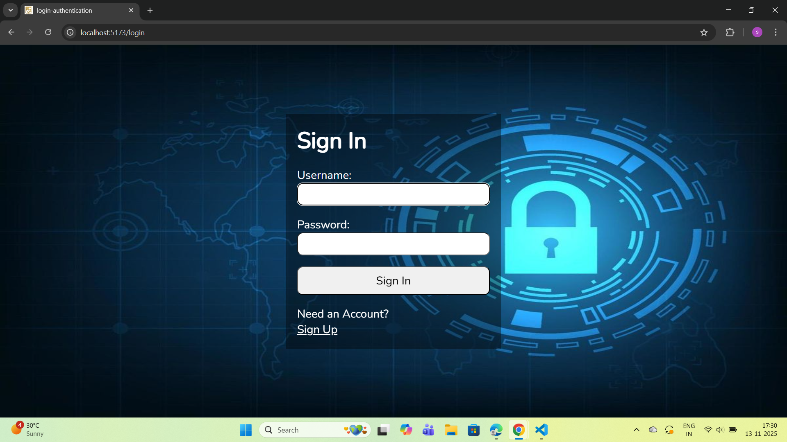
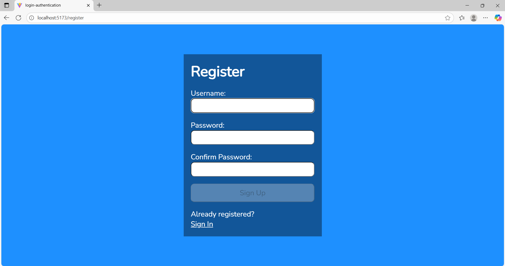

    # React Authentication Frontend

A modern React-based user authentication interface including **Login**, **Register**, and **Protected Routes** using Context API and Axios.

## 🚀 Features

* ✅ User Registration (Signup)
* ✅ User Login with validation
* ✅ Persistent Auth state (Context API)
* ✅ Protected / Private Routes
* ✅ Axios instance setup for API calls
* ✅ Responsive UI

## 🛠 Tech Stack

* React 18
* React Router
* Context API
* Axios
* Vite

## 📦 Installation

```bash
# Clone repository
git clone <your-repo-url>

# Navigate to project
cd your-project-folder

# Install dependencies
npm install

# Start development server
npm run dev
```

## 📁 Folder Structure

```
src/
 ├── api/axios.js
 ├── context/AuthProvider.jsx
 ├── pages/
 │    ├── Login.jsx
 │    └── Register.jsx
 ├── components/
 │    └── ProtectedRoute.jsx
 ├── App.jsx
 └── main.jsx
```

## 🔐 Authentication Flow

1. User enters login/signup details
2. Axios sends request to backend
3. Context stores user state (if success)
4. Protected routes check login before rendering

## ✅ Future Improvements

* ✔ Password reset page
* ✔ JWT token refresh
* ✔ Google login (OAuth)
* ✔ Better UI styling




